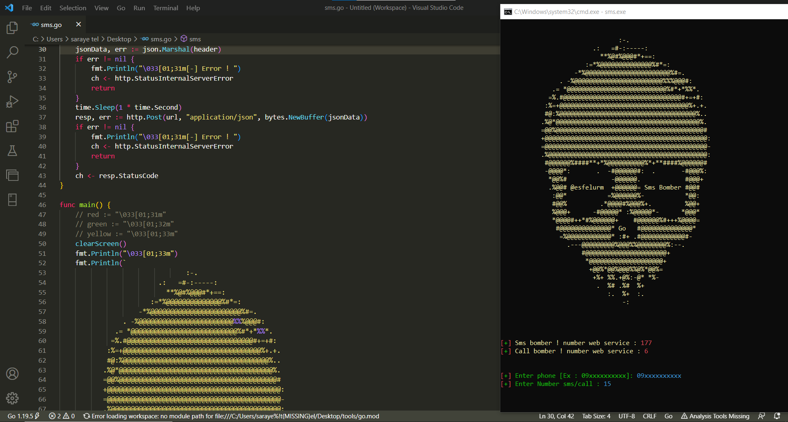

# iran-bomber
sms bomber pro v1 with Go (Golang)


## Number of web services 

- Sms : 177
- Call : 6

## Speed +

## Support from [tested]
- `Linux`
- `Windows`
- `Termux`

## screen shot




## Video test

<video> <source src="https://www.mp4.ir/Video?Watch=271347-309058022"></video>

## Run in windows

`Enter the Windows folder and run the sms.exe file`

## Run in Linux/Termux

- Linux : ```sudo apt install golang -y```

- Termux : ```pkg install golang -y ```

<h3>views :</h3>
<br>

 
